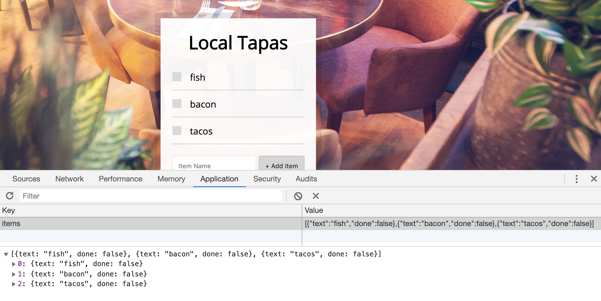

# 15. Local Storage

#### _JLocal Storage by JavaScript30 10/18/19_

## Description
This is Local Storage, 15th application out of 30 by 30 day Vanilla JavaScript Coding Challenge by Wes Bos.<br>
Please check the challenge from [JavaScript30](http://wesbos.com/javascript30/).


## About this Application:
- The data will be stored in the local storage.

- The list will stay when a user updates a page.
- Each items are checkboxes. A user can toggle the items.
    

## Setup/Installation Requirements

1. Clone this repo:
```
$ git clone https://github.com/misakimichy/JS30-15-local-storage.git
```

2. Navigate to the top level of the cloned directory.

3. Open `index.html` with your preferred web browser.

4. Open the console on your browser.

5. Please check both the `main.js` and console.

## Known Bugs
* No known bugs at this time.

## Support and contact details
 I welcome any feedbacks and comments: misaki.koonce@gmail.com

## Technologies Used
_Git, GitHub, HTML, CSS, Vanilla JavaScript

## License
Copyright © 2019 under the MIT License